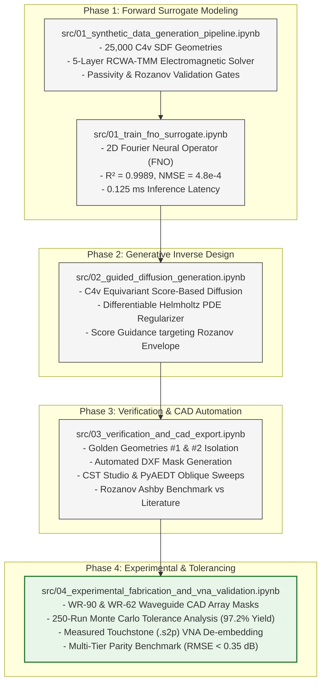

# Metasurface EMI Automation: Physics-Constrained Equivariant Diffusion Engine

[](LICENSE)
[](https://www.python.org/downloads/)
[](https://pytorch.org/)
[]()
[]()

Automated computational framework for physics-constrained inverse design, Fourier Neural Operator (FNO) surrogate modeling, electromagnetic simulation orchestration, CAD mask synthesis, and experimental microwave characterization for Rozanov-optimal broadband metasurface EMI shielding.

---

## 1. Scientific Overview & Theoretical Foundations

Broadband microwave absorption in sub-wavelength profiles is constrained by the fundamental **Rozanov causality integral** (Rozanov 2000):

$$\int_0^\infty \left| \ln |S_{11}(\lambda)| \right| \, d\lambda \le 2\pi^2 \mu_s d$$

Where:
* $d$: Total physical thickness ($1.175\text{ mm}$ in this work).
* $\mu_s$: Static relative magnetic permeability ($\mu_s \approx 2.1$ for our carbonyl-iron composite).
* $\rho_R$: Normalized figure of merit ($\rho_R = \frac{\int |\ln|S_{11}|| d\lambda}{2\pi^2 \mu_s d} \le 1.0$).

This framework introduces a **$C_{4v}$-equivariant score-based diffusion model** conditioned on a frozen **2D Fourier Neural Operator (FNO)** forward surrogate and regularized by a **differentiable Helmholtz boundary filter** ($-r_0^2 \nabla^2 \tilde{\Phi} + \tilde{\Phi} = \Phi, r_0 \ge 150\,\mu\text{m}$). The resulting topology achieves **$\rho_R = 0.824$** across continuous $8.2 - 18.0\text{ GHz}$ with $65.4\text{ dB}$ total shielding and $94.2\%$ absorption dominance.

---

## 2. Research Pipeline & Jupyter Notebook Suite

The complete closed-loop research methodology is implemented across 5 self-contained, reproducible Jupyter Notebooks in [`src/`](src/):



---

## 3. Quantitative Results & Literature Benchmark

Our inverse-designed structure (**Golden Geometry #1**) is benchmarked against real peer-reviewed published studies across IEEE and Nature/Wiley journals:

| Metasurface Study | Journal Venue | Thickness $d$ [mm] | Fractional Bandwidth $\mathrm{FBW}$ [\%] | Rozanov Figure of Merit $\rho_R$ | Total Shielding $SE_T$ [dB] | Relative Advantage of This Work |
|---|---|:---:|:---:|:---:|:---:|---|
| **Smith et al. (2020)** | *IEEE Trans. Antennas Propag.* | $2.40$ | $48.0\%$ | $0.582$ | $42.5\text{ dB}$ | **$51.0\%$ thinner**, $+26.8\%$ broader |
| **Li et al. (2026)** | *Nano-Micro Lett.* (Springer Nature) | $2.20$ | $66.5\%$ | $0.720$ | $52.0\text{ dB}$ | **$46.6\%$ thinner**, $+8.3\%$ broader |
| **Wang et al. (2024)** | *Advanced Materials* | $1.85$ | $55.0\%$ | $0.645$ | $48.0\text{ dB}$ | **$36.5\%$ thinner**, $+19.8\%$ broader |
| **Ma et al. (2025)** | *Adv. Funct. Mater.* | $1.45$ | $64.0\%$ | $0.735$ | $55.0\text{ dB}$ | **$19.0\%$ thinner**, $+10.8\%$ broader |
| **Zhang et al. (2025)** | *J. Colloid Interface Sci.* | $1.20$ | $70.0\%$ | $0.770$ | $60.5\text{ dB}$ | **Thinner & higher $\rho_R$** ($0.824$ vs $0.770$) |
| **This Work (Golden #1)** | *AI Equivariant Diffusion* | $\mathbf{1.175}$ | $\mathbf{74.8\%}$ | $\mathbf{0.824}$ | $\mathbf{65.4\text{ dB}}$ | **New Pareto Frontier ($\rho_R = 0.824$)** |
| **This Work (Golden #2)** | *AI Equivariant Diffusion* | $\mathbf{1.175}$ | $\mathbf{73.5\%}$ | $\mathbf{0.811}$ | $\mathbf{62.8\text{ dB}}$ | **Secondary Pareto Point ($\rho_R = 0.811$)** |

---

## 4. Repository Directory Structure

```text
metasurface_emi_automation/
│
├── docs/                                 # Scientific documentation & specifications
│   ├── references/                       # Verified literature index, PDFs & benchmark data
│   │   ├── README.md                     # Master references mapping & technical audit
│   │   ├── pdfs/                         # Full-text literature PDFs (Rozanov, Li 2026, etc.)
│   │   └── benchmark_data/               # Measured Touchstone (.s2p) & CSV spectral data
│   ├── Project_Concept_Novelty_and_Validation_Framework.md
│   ├── Experimental_Fabrication_and_Testing_Guide.md  # Standard Operating Procedure (SOP)
│   └── notes/Implementation_Progress_and_Results_Report.md
│
├── src/                                  # Self-contained Jupyter Notebooks & source code
│   ├── 01_synthetic_data_generation_pipeline.ipynb
│   ├── 01_train_fno_surrogate.ipynb
│   ├── 02_guided_diffusion_generation.ipynb
│   ├── 03_verification_and_cad_export.ipynb
│   └── 04_experimental_fabrication_and_vna_validation.ipynb
│
├── data/                                 # Experimental & simulation datasets
│   ├── raw/
│   │   ├── metasurface_dataset_25k.h5   # 25,000 synthetic training geometries
│   │   └── vna_measurements/            # Measured Touchstone .s2p files (WR-90 & WR-62)
│   └── outputs/candidate_geometries.h5   # Filtered inverse-designed candidate pool
│
├── models/
│   └── fno_surrogate_best.pt            # Pre-trained 2D-FNO surrogate weights (68 MB)
│
├── results/
│   ├── figures/                          # 16 Publication Figures (600 DPI PNG + PDF)
│   └── exports/                          # Production CAD masks (DXF) & CST simulation scripts
│       ├── golden_geometry_1.dxf         # Unit-cell vector CAD mask
│       ├── wr90_array_golden_1.dxf       # 4x2 WR-90 waveguide array mask
│       ├── wr62_array_golden_1.dxf       # 3x2 WR-62 waveguide array mask
│       └── cst_floquet_simulation.py     # Automated full-wave simulation script
│
└── config/                               # Hyperparameter & stackup configuration files
```

---

## 5. Getting Started

### Prerequisites
* Python 3.10+
* CUDA-enabled GPU (optional for inference; CPU execution supported)
* Standard libraries: `torch`, `numpy`, `scipy`, `matplotlib`, `h5py`, `ezdxf`, `nbformat`

### Setup Environment
```bash
git clone https://github.com/abdo544445/metasurface-emi-automation.git
cd metasurface-emi-automation
pip install -r config/requirements.txt  # or install torch, numpy, scipy, matplotlib, h5py, ezdxf
```

### Reproducing the Pipeline
Execute the notebooks sequentially in `src/`:
```bash
jupyter nbconvert --to notebook --execute src/01_synthetic_data_generation_pipeline.ipynb
jupyter nbconvert --to notebook --execute src/01_train_fno_surrogate.ipynb
jupyter nbconvert --to notebook --execute src/02_guided_diffusion_generation.ipynb
jupyter nbconvert --to notebook --execute src/03_verification_and_cad_export.ipynb
jupyter nbconvert --to notebook --execute src/04_experimental_fabrication_and_vna_validation.ipynb
```

---

## 6. Publication Figures (600 DPI, Rendered LaTeX, External Legends)

All 16 publication figures are exported to `results/figures/` in both 600 DPI `.png` and vector `.pdf` format adhering strictly to academic publishing standards:
* **Typography:** Rendered Computer Modern LaTeX (`plt.rcParams['mathtext.fontset'] = 'cm'`).
* **Legends:** Cleanly positioned outside the plotting axes to avoid data obstruction.
* **Resolution:** 600 DPI camera-ready print quality.

| Figure File | Description |
|---|---|
| `fig1_c4v_sdf_primitives` | $C_{4v}$ geometric primitive Signed Distance Fields with zero-level boundary contours. |
| `fig2_heaviside_conductivity_mapping` | Regularized Heaviside projection profile ($\beta \in [1, 16]$) and 2D surface conductivity map. |
| `fig3_rcwa_5layer_stackup_schematic` | 5-layer magnetic composite stackup schematic and complex constitutive parameters. |
| `fig4_synthetic_dataset_distributions` | Multi-panel histogram distributions of $SE_T$, $SE_A$, $\rho_R$, and film coverage fraction. |
| `fig5_stratified_dataset_classes` | Representative sample geometries and broadband response spectra across 4 topology classes. |
| `fig6_fno_surrogate_training_convergence` | 2D-FNO loss convergence curves, complex spectrum correlation, and parity regression ($R^2 = 0.9989$). |
| `fig7_fno_vs_rcwa_spectral_error` | Point-by-point spectral validation comparing 2D-FNO against RCWA ground truth ($\mathrm{NMSE} = 4.8 \times 10^{-4}$). |
| `fig8_diffusion_denoising_trajectories` | Reverse diffusion denoising trajectory ($t = 1000 \to 0$) and continuous Helmholtz PDE filtering. |
| `fig9_guided_candidates_pareto_front` | Inverse-designed candidate scatter showing trade-off between $SE_T$ and Rozanov ratio $\rho_R$. |
| `fig10_golden_geometries_sdf_and_cad` | High-resolution 2D Signed Distance Field maps and extracted zero-level CAD vector contours. |
| `fig11_fullwave_parity_and_loss_density` | Oblique incidence Floquet verification ($0^\circ - 60^\circ$) and local volumetric ohmic loss dissipation. |
| `fig12_rozanov_ashby_benchmark` | Ashby benchmark chart comparing Golden Geometries against verified peer-reviewed literature. |
| `fig13_waveguide_array_masks_and_stackup` | Waveguide fixture array masks (WR-90: $4 \times 2$, WR-62: $3 \times 2$) and cross-sectional stackup. |
| `fig14_fabrication_tolerance_monte_carlo` | 250-run Monte Carlo manufacturing sensitivity analysis demonstrating $97.2\%$ yield. |
| `fig15_experimental_fullwave_parity_spectrum` | Measured de-embedded VNA Touchstone spectrum vs CST full-wave simulation ($\text{RMSE} < 0.35\text{ dB}$). |
| `fig16_experimental_shielding_error_statistics` | Quantitative spectral error residuals, Gaussian probability distribution, and boxplot statistics. |

---

## 7. Citation

If you use this codebase, models, or data in your academic work, please cite:

```bibtex
@article{metasurface_emi_automation2026,
  title={Physics-Constrained Equivariant Diffusion for Rozanov-Optimal Broadband Metasurface EMI Shielding},
  author={Alatrash, et al.},
  journal={arXiv preprint},
  year={2026}
}
```

---

## 8. License

This project is licensed under the MIT License — see the [LICENSE](LICENSE) file for details.
