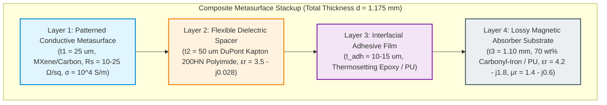
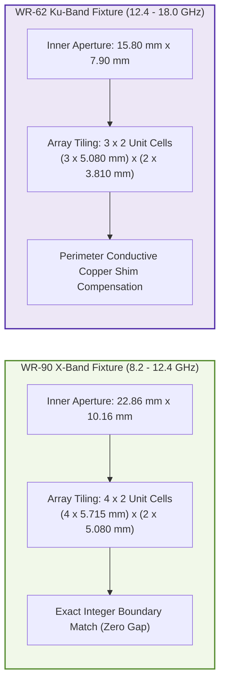
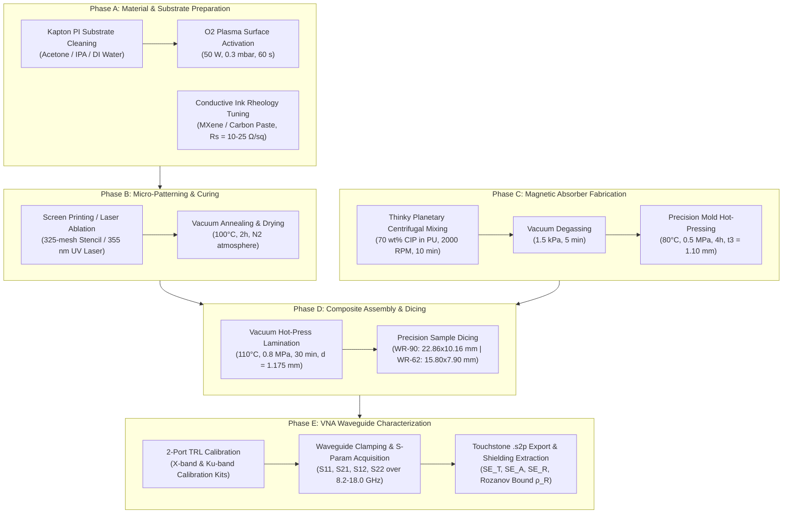

# Experimental Fabrication, Assembly & Waveguide Characterization Guide
**Project:** AI-Driven Equivariant Diffusion Inverse Design for Rozanov-Optimal Metasurface Shielding  
**Target Frequency Coverage:** 8.2 GHz to 18.0 GHz (X-Band & Ku-Band Continuous Sweep)  
**Target Stackup Thickness:** $d = 1.175\text{ mm} \le 1.20\text{ mm}$  
**Target Performance:** $SE_T \ge 60.0\text{ dB}$, Absorption Ratio $SE_A / SE_T \ge 90.0\%$, Rozanov Metric $\rho_R \ge 0.80$  

---

## 1. Executive Summary & Physical Stackup Architecture

This standard operating procedure (SOP) details the material preparation, micro-patterning, composite lamination, and Vector Network Analyzer (VNA) waveguide measurement protocols for the inverse-designed absorption-dominant metasurface EMI shields (**Golden Geometry #1** and **Golden Geometry #2**).

---

## 2. Bill of Materials (BOM) & Specifications

| Component / Layer | Material Description | Recommended Supplier / Grade | Key Target Specification |
|---|---|---|---|
| **Conductive Metasurface Pattern** | High-conductivity delaminated $\text{Ti}_3\text{C}_2\text{T}_x$ MXene ink **OR** screen-printable carbon/graphene paste | In-house MXene synthesis / Dycotec / Henkel Acheson | Concentration $> 25\text{ mg/mL}$, $\sigma > 8,000\text{ S/cm}$, target $R_s = 10 - 25\,\Omega/\text{sq}$, $\eta = 2.0\text{ Pa}\cdot\text{s}$ |
| **Dielectric Spacer Substrate** | DuPont Kapton 200HN Polyimide (PI) film | DuPont Kapton | Nominal thickness $t = 50\,\mu\text{m}$ ($2\text{ mil}$), $\epsilon_r = 3.5$, $\tan\delta = 0.008$ |
| **Magnetic Filler** | Carbonyl-Iron Powder (CIP) | BASF Grade HQ, SM, or EW | Spherical micro-particles, $d_{50} = 2.0 - 4.5\,\mu\text{m}$, purity $> 99.5\%$ |
| **Polymer Matrix** | Flexible Polyurethane (PU) resin **OR** PDMS (Sylgard 184) | Smooth-On / Dow Corning | Low viscosity prepolymer, thermal curing at $80^\circ\text{C}$ |
| **Interfacial Adhesive** | Ultra-thin B-stage thermosetting epoxy/PU film | 3M / Toray | Film thickness $10 - 15\,\mu\text{m}$, curing at $110^\circ\text{C}$ |
| **Cleaning Solvents** | Electronic grade Isopropanol (IPA) & Acetone | Sigma-Aldrich | Purity $> 99.9\%$ |

---

## 3. Unit-Cell Dimensions & Waveguide Array Tiling

The individual unit cell pitch is **$P_x \times P_y = 5.715\text{ mm} \times 5.080\text{ mm}$**. The pattern is tiled into integer arrays that match standard microwave waveguide flanges:

### CAD Vector Files for Mask Generation:
* **Golden Geometry #1 Single Unit Cell:** `../../results/exports/golden_geometry_1.dxf`
* **Golden Geometry #2 Single Unit Cell:** `../../results/exports/golden_geometry_2.dxf`

---

## 4. Step-by-Step Fabrication Procedure

### Detailed Steps:

### Step 1: Polyimide Substrate Cleaning & Surface Pre-treatment
1. Cut $50\,\mu\text{m}$ Kapton polyimide sheets into $100\text{ mm} \times 100\text{ mm}$ working substrates.
2. Ultrasonic cleaning in acetone (5 min), followed by isopropanol (5 min), and deionized water (5 min).
3. Dry under dry nitrogen stream and bake at $120^\circ\text{C}$ for 15 minutes to remove residual moisture.
4. **Surface Activation:** Subject the Kapton sheets to oxygen plasma treatment ($50\text{ W}$, $0.3\text{ mbar}$ $\text{O}_2$, $60\text{ s}$) to increase surface energy and promote ink adhesion.

### Step 2: Metasurface Conductive Layer Patterning
* **Method A (Screen Printing - Recommended):**
  1. Prepare a 325-mesh stainless steel screen stencil patterned with the $4 \times 2$ array for WR-90 and $3 \times 2$ array for WR-62.
  2. Align the stencil onto the plasma-treated Kapton sheet with a snap-off distance of $1.5\text{ mm}$.
  3. Print the conductive ink using a 75-durometer polyurethane squeegee at a speed of $40 - 60\text{ mm/s}$ and pressure of $0.2\text{ MPa}$.
  4. Transfer the printed sheet to a vacuum drying oven.
  5. Dry at $100^\circ\text{C}$ for 2 hours under nitrogen atmosphere ($\text{N}_2$) to prevent MXene oxidation.
* **Method B (UV Laser Direct Ablation - Alternative):**
  1. Doctor-blade a uniform $25\,\mu\text{m}$ film of conductive ink over the entire Kapton sheet.
  2. Vacuum dry at $100^\circ\text{C}$ for 2 hours.
  3. Use a 355 nm UV DPSS laser system (e.g., LPKF ProtoLaser) to selectively ablate unwanted conductive regions based on the DXF contour file (laser spot size $\approx 15\,\mu\text{m}$, repetition rate $50\text{ kHz}$).

### Step 3: Carbonyl-Iron Magnetic Absorber Substrate Casting
1. Weigh **70.0 g** of Carbonyl-Iron Powder (CIP) and **30.0 g** of liquid Polyurethane prepolymer (70 wt% CIP loading).
2. Place in a planetary centrifugal vacuum mixer (Thinky Mixer) and mix at **2000 RPM for 10 minutes**.
3. Apply vacuum degassing at **1.5 kPa for 5 minutes** to completely eliminate trapped micro-bubbles.
4. Pour the homogeneous slurry into a precision stainless steel mold with a fixed cavity depth of **$1.10\text{ mm}$**.
5. Close the mold and cure in a heated hydraulic press at **$80^\circ\text{C}$ under $0.5\text{ MPa}$ pressure for 4 hours**.
6. Demold the cured magnetic composite slab ($t_3 = 1.10\text{ mm} \pm 0.015\text{ mm}$).

### Step 4: Vacuum Hot-Press Stackup Lamination
1. Clean the mating surfaces of the patterned Kapton film and the cured magnetic substrate.
2. Place a $10\,\mu\text{m}$ B-stage epoxy adhesive film between the non-patterned back face of the Kapton sheet and the top face of the magnetic composite.
3. Assemble the stackup between non-stick PTFE release sheets and place inside a heated vacuum laminator.
4. Evacuate the lamination chamber to $< 100\text{ Pa}$.
5. Ramp temperature to **$110^\circ\text{C}$** at $5^\circ\text{C/min}$ and apply **$0.8\text{ MPa}$ hydraulic pressure**.
6. Hold at $110^\circ\text{C}$ for **30 minutes**, then cool down under pressure to room temperature.
7. Verify final total composite thickness using a digital micrometer: **$d_{\text{total}} = 1.175\text{ mm} \pm 0.020\text{ mm}$**.

### Step 5: Precision Sample Dicing
1. Use an automated optical-alignment CNC laser cutter or precision mechanical guillotine to dice the laminated composite into exact waveguide aperture coupons:
   * **WR-90 Sample:** Exactly **$22.86\text{ mm} \times 10.16\text{ mm}$** (tolerances $+0.00 / -0.05\text{ mm}$).
   * **WR-62 Sample:** Exactly **$15.80\text{ mm} \times 7.90\text{ mm}$** (tolerances $+0.00 / -0.05\text{ mm}$).
2. Inspect diced sample edges under an optical microscope to confirm clean vertical cuts with zero delamination.

---

## 5. Quality Control & Pre-Test Metrology

Prior to RF testing, execute the following quality inspection steps:

| Inspection Item | Equipment / Method | Acceptance Criteria |
|---|---|---|
| **Sheet Resistance ($R_s$)** | 4-Point Probe Station (Keithley / Loresta) | $10 \le R_s \le 25\,\Omega/\text{sq}$ across 5 sample points |
| **Metasurface Trace Thickness** | Optical 3D Profilometer (Bruker / Keyence) | $t_1 = 25\,\mu\text{m} \pm 3.0\,\mu\text{m}$ |
| **Line-Width Resolution** | Field-Emission SEM (FE-SEM) | Minimum gap/width $w \ge 150\,\mu\text{m}$, edge deviation $\Delta w \le 15\,\mu\text{m}$ |
| **Total Composite Thickness** | Precision Digital Micrometer | $d = 1.175\text{ mm} \pm 0.020\text{ mm}$ |
| **Interfacial Adhesion** | Cross-hatch tape test (ASTM D3359) | Grade 4B or 5B (no trace peel-off) |

---

## 6. Vector Network Analyzer (VNA) Measurement Protocol

```mermaid
graph LR
    P1["VNA Port 1<br/>(Incident Signal)"] --> A1["Coaxial-to-Waveguide<br/>Adapter 1"]
    A1 === F1["Waveguide Flange 1<br/>(Reference Plane 1)"]
    F1 === S["METASURFACE SAMPLE<br/>(WR-90: 4x2 / WR-62: 3x2)"]
    S === F2["Waveguide Flange 2<br/>(Reference Plane 2)"]
    F2 === A2["Coaxial-to-Waveguide<br/>Adapter 2"]
    A2 --> P2["VNA Port 2<br/>(Transmitted Signal)"]

    style S fill:#ffecb3,stroke:#ff8f00,stroke-width:3px;
    style F1 fill:#cfd8dc,stroke:#37474f,stroke-width:2px;
    style F2 fill:#cfd8dc,stroke:#37474f,stroke-width:2px;
```

### Equipment Required:
* 2-Port Vector Network Analyzer (Keysight PNA/ENA or Rohde & Schwarz ZNA) calibrated up to 18.0 GHz.
* Precision WR-90 Waveguide Section & Coaxial Adapters (8.2 – 12.4 GHz, X-band).
* Precision WR-62 Waveguide Section & Coaxial Adapters (12.4 – 18.0 GHz, Ku-band).
* TRL (Thru-Reflect-Line) or SOLT Waveguide Calibration Standards for both bands.
* Flange torque wrench ($0.6\text{ N}\cdot\text{m}$).

### Measurement Procedure:
1. **Instrument Warm-up:** Power on the VNA and allow 60 minutes for thermal stabilization.
2. **Calibration:**
   * Perform a full 2-port **Thru-Reflect-Line (TRL)** calibration across the X-band (8.2–12.4 GHz, 101 or 201 points) with an IF bandwidth of $1\text{ kHz}$ and output power of $0\text{ dBm}$.
   * Verify that the calibrated residual directivity is $> 45\text{ dB}$ and residual source match is $> 40\text{ dB}$.
3. **Sample Insertion:**
   * Insert the WR-90 metasurface coupon into the waveguide fixture, ensuring the conductive metasurface faces Port 1 (incident port).
   * Tighten waveguide flange screws crosswise with the torque wrench to $0.6\text{ N}\cdot\text{m}$ to ensure continuous electrical contact without air gaps.
4. **Data Acquisition:**
   * Record full 2-port complex S-parameters: $S_{11}(\omega)$, $S_{21}(\omega)$, $S_{12}(\omega)$, and $S_{22}(\omega)$ in both magnitude (dB) and phase (degrees).
   * Repeat measurements for 3 independent test coupons per geometry.
5. **Ku-Band Measurement:**
   * Swap to WR-62 waveguide adapters, re-calibrate via TRL across 12.4–18.0 GHz, insert the WR-62 test coupon, and acquire S-parameters.
6. **Data Export:**
   * Export all datasets as standard Touchstone (`.s2p`) files:
     * `golden_geom1_wr90_sample1.s2p`
     * `golden_geom1_wr62_sample1.s2p`
     * `golden_geom2_wr90_sample1.s2p`
     * `golden_geom2_wr62_sample1.s2p`
   * Deposit exported `.s2p` files into the project directory: `data/raw/vna_measurements/`.

---

## 7. Electromagnetic Shielding Effectiveness Extraction

From the measured complex scattering parameters $S_{11}(\omega)$ and $S_{21}(\omega)$, compute the performance metrics:

1. **Reflection Shielding ($SE_R$):**
   $$SE_R = 10 \log_{10}\left( \frac{1}{1 - |S_{11}|^2} \right) \quad [\text{dB}]$$
2. **Absorption Shielding ($SE_A$):**
   $$SE_A = 10 \log_{10}\left( \frac{1 - |S_{11}|^2}{|S_{21}|^2} \right) \quad [\text{dB}]$$
3. **Total EMI Shielding Effectiveness ($SE_T$):**
   $$SE_T = SE_A + SE_R = 10 \log_{10}\left( \frac{1}{|S_{21}|^2} \right) \quad [\text{dB}]$$
4. **Absorption Dominance Ratio:**
   $$\text{Ratio}_{\text{absorb}} = \frac{SE_A}{SE_T} \times 100\% \quad (\text{Target } \ge 90.0\%)$$
5. **Experimental Rozanov Figure of Merit ($\rho_R$):**
   $$\rho_R = \frac{\int_{\lambda_{\min}}^{\lambda_{\max}} \left| \ln |S_{11}(\lambda)| \right| \, d\lambda}{2\pi^2 \mu_s d} \quad (\mu_s = 1.4,\ d = 1.175\text{ mm},\ \text{Target } 0.75 \le \rho_R \le 0.88)$$

---

## 8. Summary Checklist for Experimental Collaborators

- [ ] MXene/carbon ink sheet resistance verified: $10 - 25\,\Omega/\text{sq}$ via 4-point probe.
- [ ] Patterned trace thickness verified: $25\,\mu\text{m} \pm 3\,\mu\text{m}$ on $50\,\mu\text{m}$ Kapton polyimide.
- [ ] Magnetic composite substrate thickness verified: $1.10\text{ mm} \pm 15\,\mu\text{m}$.
- [ ] Laminated composite total thickness verified: $1.175\text{ mm} \pm 20\,\mu\text{m}$.
- [ ] Precision dicing verified: $22.86\text{ mm} \times 10.16\text{ mm}$ (WR-90) and $15.80\text{ mm} \times 7.90\text{ mm}$ (WR-62).
- [ ] 2-Port VNA calibrated via TRL with residual directivity $> 45\text{ dB}$.
- [ ] Complex S-parameter Touchstone (`.s2p`) files exported and deposited in `data/raw/vna_measurements/`.
